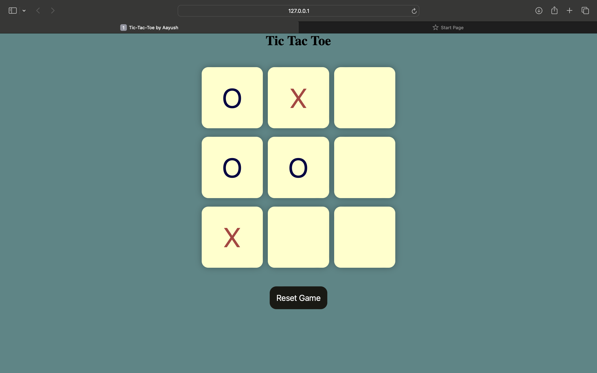

# Tic-Tac-Toe Game

This is a simple Tic-Tac-Toe game implemented in JavaScript, HTML, and CSS. The game allows two players to play against each other by clicking on the empty squares in a 3x3 grid. The first player to get three of their symbols in a row, column, or diagonal wins the game. If all squares are filled and no player has won, the game is declared a draw.

### Getting Started
To get started, open the index file in a web browser. The game will start automatically.

### Gameplay
To make a move, click on an empty square in the 3x3 grid. The first player to make three of their symbols in a row, column, or diagonal wins the game. If all squares are filled and no player has won, the game is declared a draw.

To start a new game, click on the "New Game" button. To reset the game, click on the "Reset" button.

### Code Overview
The code is organized into the following files:

index.html: The HTML file that defines the structure and layout of the game.

style.css: The CSS file that defines the styling of the game.
script.js: The JavaScript file that defines the game logic and functionality.

### The code is structured as follows:

The script.js file initializes the game by selecting all the necessary elements on the page and adding event listeners to them.

The checkWinner function checks if a player has won the game by checking for three matching symbols in a row, column, or diagonal.

The gameDraw function checks if the game has ended in a draw.

The showWinner function displays a message indicating the winner of the game.

The resetGame function resets the game to its initial state.
The disableBoxes function disables all the boxes in the grid.
The enableBoxes function enables all the boxes in the grid.
The newGameBtn and resetBtn elements are used to start a new game or reset the current game.

## Screenshots

